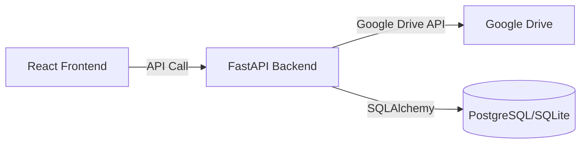

# SDD: Google Drive Structure Sync

**Version:** 1.0
**Date:** 2025-11-20
**Status:** Draft

---

## 1. Overview

This document outlines the design for synchronizing the MATHESIS LAB curriculum structure with Google Drive. The goal is to create a mirror of the application's structure (Curriculums and Nodes) as Folders in Google Drive, and to store uploaded resources (PDFs) within these folders.

### 1.1 Objectives
- **Curriculum Sync:** Creating a Curriculum in the app creates a corresponding folder in Google Drive.
- **Node Sync:** Creating a Node in the app creates a corresponding sub-folder within the Curriculum folder.
- **Resource Sync:** Uploading a PDF to a Node uploads the file to the Node's folder in Google Drive.
- **Linkage:** The Google Drive file/folder IDs are stored in the database to maintain the link.

---

## 2. Architecture

### 2.1 Component Diagram



### 2.2 Responsibility
- **Frontend:** Triggers creation events (Create Curriculum, Create Node, Upload PDF).
- **Backend:** Handles the actual Google Drive API interactions and database updates.
- **Database:** Stores the mapping between App Entities (UUIDs) and Google Drive Entities (File/Folder IDs).

---

## 3. Data Mapping

### 3.1 Hierarchy
```
Google Drive Root
└── "MATHESIS LAB" (App Root Folder)
    └── {Curriculum Title} (Folder)
        └── {Node Title} (Folder)
            └── {Resource Name}.pdf (File)
```

### 3.2 Database Schema Updates
We need to store the Google Drive ID for each entity to avoid duplicate creations and to allow updates/deletions.

**Table: `curriculums`**
- `gdrive_folder_id` (VARCHAR, nullable): ID of the folder in Google Drive.

**Table: `nodes`**
- `gdrive_folder_id` (VARCHAR, nullable): ID of the folder in Google Drive.

**Table: `node_links` (for PDFs)**
- `gdrive_file_id` (VARCHAR, nullable): ID of the uploaded file in Google Drive.

---

## 4. Detailed Workflows

### 4.1 Google Drive Service (`backend/app/services/gdrive_service.py`)
This service encapsulates all Google Drive API interactions.

- `create_folder(name: str, parent_id: str = None) -> str (folder_id)`
- `upload_file(file_obj, filename: str, parent_id: str) -> str (file_id)`
- `delete_file(file_id: str)`
- `get_webview_link(file_id: str) -> str`

### 4.2 Curriculum Creation
1. User creates Curriculum "Physics 101".
2. Backend saves Curriculum to DB.
3. Backend calls `gdrive_service.create_folder("Physics 101", parent_id=APP_ROOT_ID)`.
4. Backend updates Curriculum record with returned `gdrive_folder_id`.

### 4.3 Node Creation
1. User creates Node "Newton's Laws" under "Physics 101".
2. Backend saves Node to DB.
3. Backend retrieves `gdrive_folder_id` of the parent Curriculum.
4. Backend calls `gdrive_service.create_folder("Newton's Laws", parent_id=curriculum_folder_id)`.
5. Backend updates Node record with returned `gdrive_folder_id`.

### 4.4 PDF Upload
1. User uploads "Lecture1.pdf" to Node "Newton's Laws".
2. Backend retrieves `gdrive_folder_id` of the target Node.
3. Backend calls `gdrive_service.upload_file(file, "Lecture1.pdf", parent_id=node_folder_id)`.
4. Backend creates a `node_links` record with `link_type='PDF'` and stores `gdrive_file_id`.

---

## 5. Error Handling & Edge Cases

- **Network Failure:** If Drive API fails, the local entity should still be created, but marked as "unsynced" (or `gdrive_folder_id` remains null). A background retry mechanism or manual "Sync Now" button might be needed.
- **Name Conflicts:** Google Drive allows duplicate names. We should probably append a short hash or ID if a name collision is detected, or rely on IDs internally and not worry about display name uniqueness in Drive.
- **Deletion:** Deleting a Curriculum/Node in the app should optionally delete the corresponding Drive folder (soft delete/trash).

---

## 6. Security
- **Authentication:** Use a Service Account for backend-to-Drive communication, OR use OAuth2 User Credentials if the data should belong to the user's personal Drive.
    - *Decision:* The user request implies "My Curriculums" in "Google Drive", suggesting **User OAuth2**. The user should authenticate with their Google Account, and the app accesses *their* Drive.
- **Scopes:** `https://www.googleapis.com/auth/drive.file` (Recommended: only access files created by the app).

