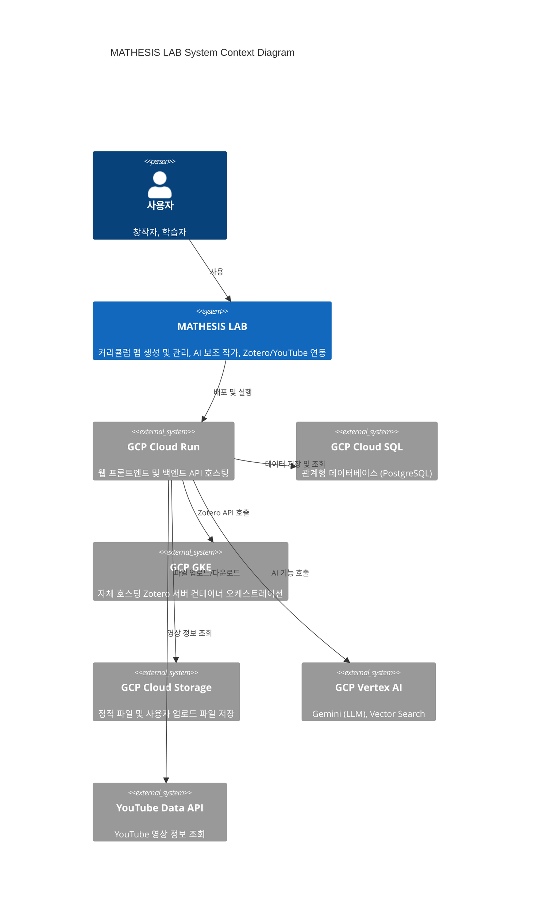
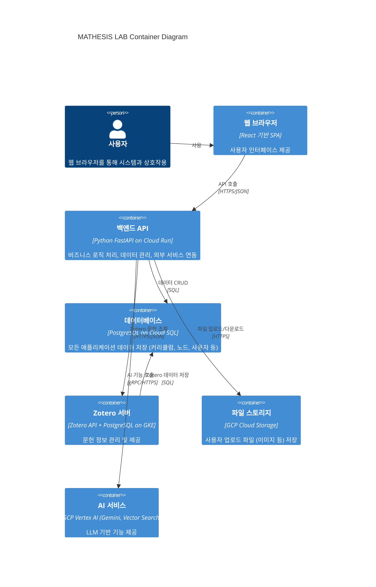

# 소프트웨어 아키텍처 문서 (SAD - Software Architecture Document)

## 1. 개요
이 문서는 'MATHESIS LAB' 프로젝트의 소프트웨어 아키텍처를 정의하고 설명합니다. GCP 아키텍처(v4.0)를 기반으로 시스템의 주요 컴포넌트, 이들 간의 상호작용, 그리고 기술 스택을 명확히 하여 개발 팀이 시스템 전체를 이해하고 일관된 방식으로 개발을 진행할 수 있도록 돕습니다.

## 2. 아키텍처 다이어그램

### 2.1. 시스템 컨텍스트 다이어그램 (C4 Model Level 1)
'MATHESIS LAB' 시스템과 외부 사용자 및 주요 외부 시스템(GCP 서비스) 간의 관계를 보여줍니다.

### 2.2. 컨테이너 다이어그램 (C4 Model Level 2)
'MATHESIS LAB' 시스템 내부의 주요 컨테이너(애플리케이션 및 데이터 저장소)와 이들 간의 상호작용을 보여줍니다.

## 3. 컴포넌트 정의

### 3.1. 웹 프론트엔드 (Web Frontend)
*   **역할:** 사용자 인터페이스(UI)를 제공하고, 백엔드 API와 통신하여 데이터를 표시하고 사용자 입력을 처리합니다.
*   **책임:** 커리큘럼 맵 렌더링, 노드 드래그 앤 드롭 처리, 사용자 인증/인가 흐름 관리, Zotero/YouTube 임베딩.
*   **기술 스택:** React, TypeScript, Next.js (SSR/SSG 고려), Tailwind CSS, Material UI.
*   **배포 환경:** GCP Cloud Run (정적 파일 서빙 또는 Next.js 서버).

### 3.2. 백엔드 API (Backend API)
*   **역할:** 비즈니스 로직을 처리하고, 데이터베이스 및 외부 서비스(Zotero, Vertex AI, YouTube)와의 연동을 담당합니다.
*   **책임:** 사용자 인증/인가, 커리큘럼/노드 CRUD, Zotero API 호출, Vertex AI 호출, YouTube Data API 호출.
*   **기술 스택:** Python, FastAPI, SQLAlchemy (ORM), Pydantic (데이터 유효성 검사).
*   **배포 환경:** GCP Cloud Run.

### 3.3. 데이터베이스 (Database)
*   **역할:** 'MATHESIS LAB' 애플리케이션의 모든 영구 데이터를 저장하고 관리합니다.
*   **책임:** 커리큘럼 맵, 노드, 사용자 정보, Zotero 문헌 연결 정보 등.
*   **기술 스택:** PostgreSQL.
*   **배포 환경:** GCP Cloud SQL.

### 3.4. Zotero 서버 (Zotero Server)
*   **역할:** 자체 호스팅 Zotero 인스턴스를 운영하며, 문헌 정보를 관리하고 백엔드 API에 제공합니다.
*   **책임:** Zotero 라이브러리 데이터 저장, Zotero API를 통한 문헌 검색 및 관리.
*   **기술 스택:** Zotero (Docker 컨테이너), PostgreSQL (Zotero 데이터베이스).
*   **배포 환경:** GCP GKE (Kubernetes).

### 3.5. 파일 스토리지 (File Storage)
*   **역할:** 사용자 업로드 파일(예: AI 분석을 위한 이미지) 및 애플리케이션의 정적 자산을 저장합니다.
*   **책임:** 파일의 안전한 저장, 접근 제어, 고가용성 제공.
*   **기술 스택:** GCP Cloud Storage.
*   **배포 환경:** GCP Cloud Storage.

### 3.6. AI 서비스 (AI Service)
*   **역할:** LLM 기반의 AI 기능을 제공합니다.
*   **책임:** 이미지 기반 Manim 코드 가이드라인 생성, 노드 내용 요약/확장/질의응답.
*   **기술 스택:** GCP Vertex AI (Gemini Pro, Gemini Pro Vision, Vector Search).
*   **배포 환경:** GCP Vertex AI.

## 4. 기술 스택 요약
*   **프론트엔드:** React, TypeScript, Next.js, Tailwind CSS, Material UI
*   **백엔드:** Python, FastAPI, SQLAlchemy, Pydantic
*   **데이터베이스:** PostgreSQL
*   **클라우드 플랫폼:** Google Cloud Platform (GCP)
    *   **컴퓨팅:** Cloud Run, GKE
    *   **데이터베이스:** Cloud SQL
    *   **스토리지:** Cloud Storage
    *   **AI/ML:** Vertex AI (Gemini)
*   **CI/CD:** GitHub Actions
*   **모니터링/로깅:** Cloud Monitoring, Cloud Logging
